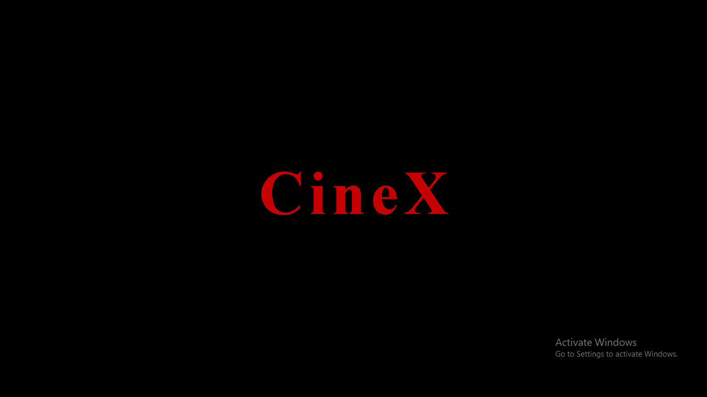
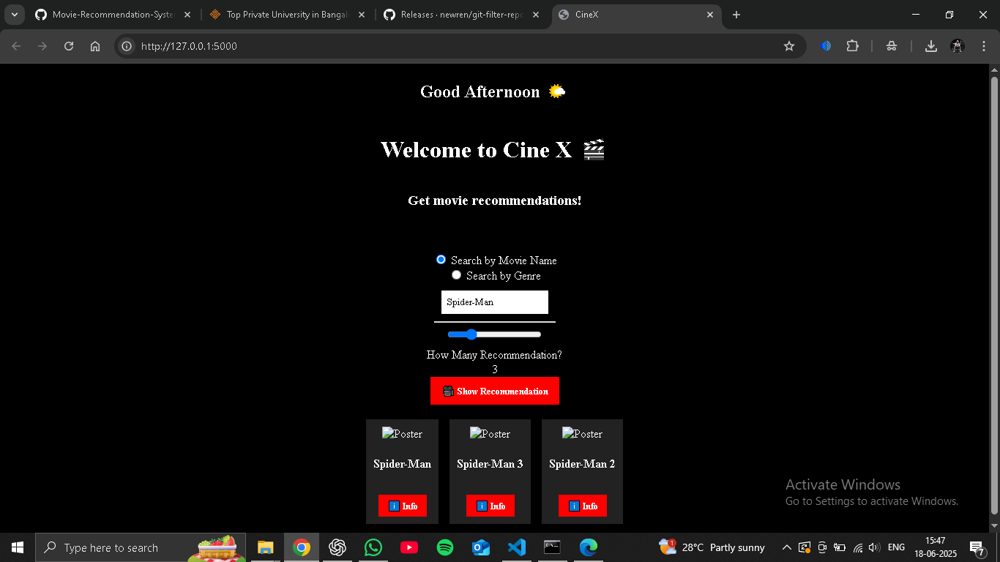
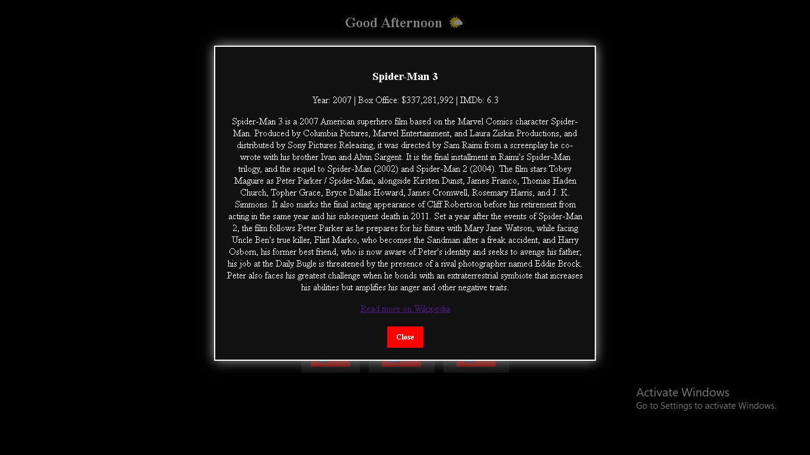

# 🎬 Movie Recommender System

CineX is a web-based movie recommendation system built using **Flask**, **Python**, **HTML/CSS/JavaScript**, and the **TMDB + OMDb + Wikipedia APIs**. It provides personalized movie suggestions either by title or genre, along with trailers, posters, summaries, box office data, and IMDb ratings.

## 🚀 Features

- 🔍 **Search by Movie Name** – Get recommendations based on a movie you love.
- 🎭 **Search by Genre** – Discover top movies from a specific genre.
- 📽️ **Posters & Trailers** – Fetch movie posters and YouTube trailers via TMDB.
- 🧠 **ML-Powered Recommendations** – Uses cosine similarity to recommend similar movies.
- 📊 **Movie Info Modals** – Shows Wikipedia summary, IMDb ratings, and Box Office collection.
- 🌞 **Dynamic Greeting** – Displays good morning/afternoon/evening message based on time.
- 🎨 **Animated UI** – Beautiful CSS animations, responsive grid layout, and loading spinners.
- 💡 **Autocomplete Suggestions** – Real-time suggestion box while typing movie names.

---

## 📂 Project Structure

```
📁 Movie-Recommender-System
│── model/
│   ├── movie_list.pkl        # Pickle file containing movie data
│   ├── similarity.pkl        # Precomputed similarity matrix
│   ├── movies.csv            # Movie dataset
│   ├── credits.csv           # Movie credits dataset
|── static/
|   ├── styles.css            # CSS for frontend styling
|── templates/
|   ├── index.html            # HTML template for the homepage
│── app.py                    # Main Streamlit application
│── requirements.txt           # Python dependencies
│── README.md                  # Project documentation
|── notebook86c26b4f17.ipynb
```

---

## ⚙️ Installation

### 🔹 1. Clone the Repository

```bash
git clone https://github.com/yourusername/Movie-Recommender-System.git
cd Movie-Recommender-System
```

### 🔹 2. Create a Virtual Environment (Optional but Recommended)

```bash
python -m venv env
source env/bin/activate   # On macOS/Linux
env\Scripts\activate      # On Windows
```

### 🔹 3. Install Dependencies

```bash
pip install -r requirements.txt
```

### 🔹 4. Run the notebook86c26b4f17.ipynb file

Place `movie_list.pkl` and `similarity.pkl` inside the `model/` directory.

### 🔹 5. Run the Application

```bash
python app.py
```

---

## 🛠️ How It Works

1. **Data Loading**: The system loads movie data (`movies.csv`, `credits.csv`).
2. **Preprocessing**: Extracts genres and prepares data for recommendations.
3. **Machine Learning Model**: Uses a precomputed similarity matrix (`similarity.pkl`).
4. **Movie Recommendation**: Finds similar movies based on cosine similarity.
5. **Poster & Trailer Fetching**: Calls TMDB API to get movie details.
6. **Streamlit UI**: Provides an interactive web-based interface.

---

## 🖼️ Screenshots

<p>
  
  <br><em>Loading</em>
</p>

<p>
  
  <br><em>Home Page</em>
</p>

<p>
  
  <br><em>Info Page</em>
</p>


## 🌐 External APIs Used

- 🎬 **TMDB API** – for movie posters and trailers  
  🔗 [https://www.themoviedb.org/documentation/api](https://www.themoviedb.org/documentation/api)

- 📊 **OMDb API** – for IMDb rating, Box Office, and release year  
  🔗 [https://www.omdbapi.com/](https://www.omdbapi.com/)

- 📚 **Wikipedia API** – for movie summaries  
  🔗 [https://www.mediawiki.org/wiki/API:Main_page](https://www.mediawiki.org/wiki/API:Main_page)

---
## 🔮 Future Scope

- ✅ **Add Firebase-based user login**  
  Implement secure user authentication using Firebase Authentication for login, signup, and session management.

- ✅ **Save user preferences/history for better suggestions**  
  Use Firebase Firestore or Realtime Database to track user activity and personalize future recommendations based on previously liked or searched movies.

- ✅ **Add Hindi/local language support**  
  Integrate language translation APIs or datasets to provide UI and recommendations in Hindi and other regional languages.

- ✅ **Improve loading animation & UI**  
  Enhance user experience with advanced CSS animations, parallax effects, and smoother transitions during data loading and movie fetching.


## 👨‍💻 Contributors

- **Ujjal** - *Developer*
